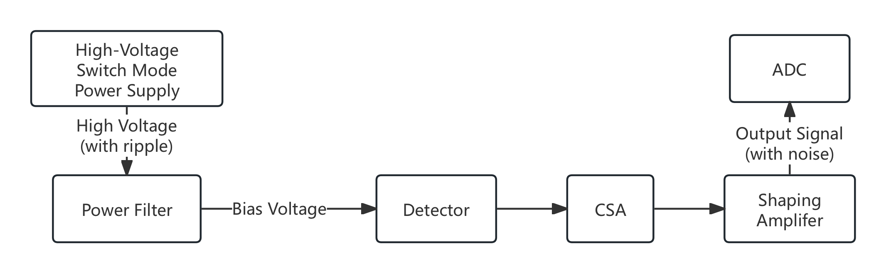
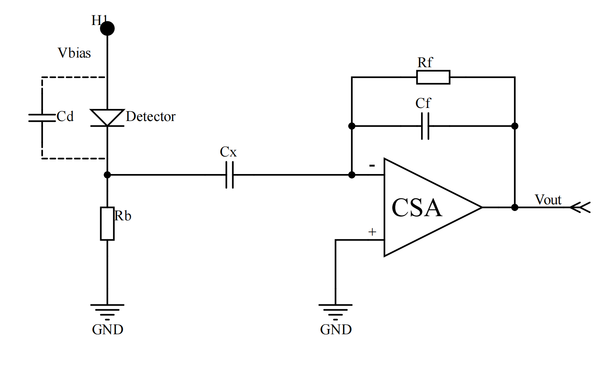
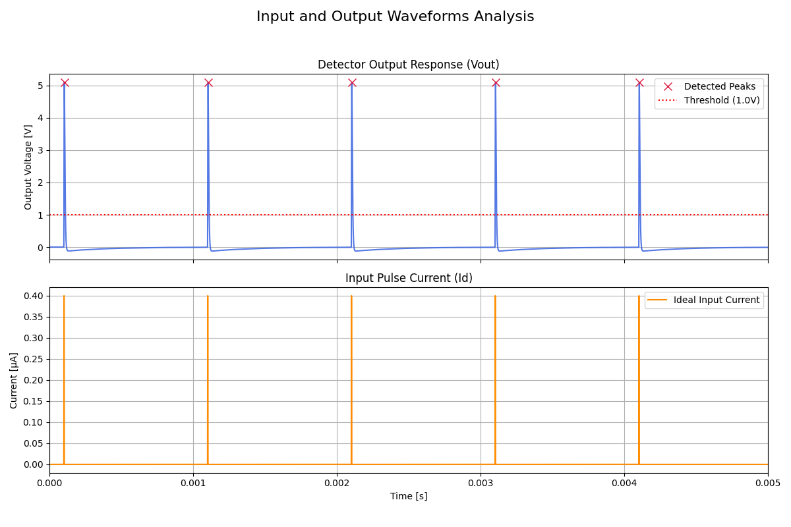
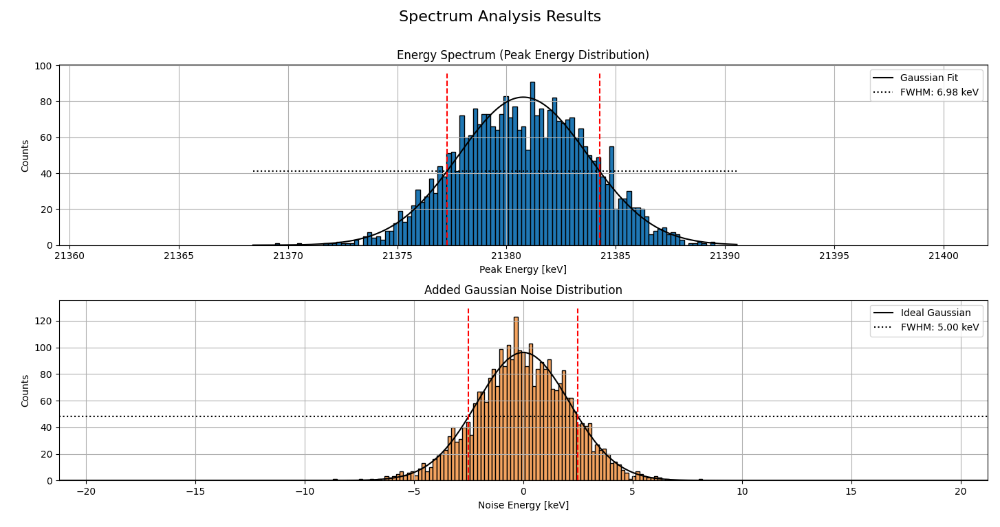
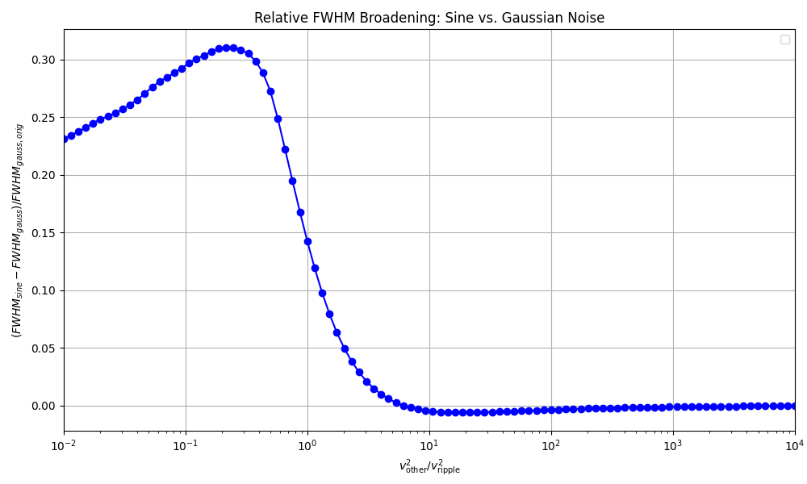

# 全文

## 1 引言

粒子辐射探测在空间物理、高能粒子物理及医学成像等领域至关重要[1，2，3]。粒子辐射探测器依赖高压开关电源，以扩大耗尽区并在耗尽区内形成强电场，驱动电离产生的电荷载流子(电子-空穴/离子对)向电极迁移，生成可测电信号。

高压开关电源纹波通过各种耦合机制影响探测器输出，增加噪声，降低信噪比，并导致数据失真[4]。低纹波的高压开关电源可以确保探测器耗尽区电场的时间一致性，使载流子的漂移稳定;同时减少耦合到输出端的噪声，提高信噪比及能量分辨率[5]。以前人们对高压开关电源纹波对粒子辐射探测器系统噪声的影响的研究定性居多，缺少定量研究[6，7]。本文将从Si-PIN 型粒子辐射探测器电路结构出发，建立从高压开关电源纹波到探测器系统输出噪声的定量理论模型，并通过系统仿真验证其适用性，为提升粒子辐射探测器的测量精度提供理论参考。

## 2 理论分析

### 2.1 电路分析

对于 Si-PIN 型粒子辐射探测器系统，与高压开关电源纹波相关的电路可以大致分为电源滤波电路、电荷敏感前置放大器和整形放大电路三个部分，如图X所示。

图1所示为电源滤波电路的等效电路，可以看作由两个RC 低通滤波器级联而成的二阶滤波架构，用于抑制高频噪声[8]。高压开关电源由BBV输入，经过该滤波网络后，通过H1端子为探测器提供偏置电压。

图2所示为探测器与电荷敏感前置放大器的结构，探测器可以等效为一个二极管和结电容 $C_{\mathrm{d}}$ 并联。在完全耗尽的情况下，结电容 $C_{\mathrm{d}}$ 可由下式计算[14]:

$$
C_{\mathrm{d}} = \frac{\varepsilon_0 \varepsilon_{\mathrm{r}} S}{D_{\mathrm{d}}} \quad (1)
$$

其中 $A_{\mathrm{s}}$ 为探测器的等效正对面积(通常在 mm² 量级)，$D_{\mathrm{d}}$ 为探测器厚度(通常在 um 量级)。由此可计算得 $C_{\mathrm{d}}$ 通常在 pF 量级。

偏置电压 $V_{\mathrm{bias}}$ 的大小与探测器的厚度有关。耗尽层厚度 d 与偏置电压的关系为 $d = \sqrt{2\varepsilon_0\varepsilon_{\mathrm{r}}\mu V_{\mathrm{bias}} / \rho}$ [14]，为了使探测器完全耗尽，偏置电压至少应该满足

$$
D_{\mathrm{d}} = \sqrt{\frac{2\varepsilon_0\varepsilon_{\mathrm{r}}\mu V_{\mathrm{bias}}}{\rho}} \quad (2)
$$

即

$$
V_{\mathrm{bias}} = \frac{D_{\mathrm{d}}^2\rho}{2\varepsilon_0\varepsilon_{\mathrm{r}}\mu} \quad (3)
$$

其中 $\rho$ 为电阻率，$\mu$ 为多数载流子迁移率。取 $\varepsilon = \varepsilon_0 = 8.85 \times 10^{-12} \text{ F/m}$， $\rho = 10 \text{k}\Omega \cdot \text{cm}$，$\mu = 1200 \text{ cm}^2/(\text{V} \cdot \text{s})$，可计算得对于厚度为 $D_{\mathrm{d}} = 200 \text{ μm}$ 的探测器，需要 $V_{\mathrm{bias}} \approx 200 \text{ V}$。

$C_{\mathrm{x}}$为隔直电容，其容值通常在nF到uF量级，用于阻隔来自探测器的直流电流。探测器产生的电荷信号经$C_{\mathrm{x}}$耦合至电荷敏感放大器(CSA)，经由CSA被放大至适合后续数字信号处理的电平。

整形放大电路通常与数模转换器一起内置在ASIC中，将放大后的信号整形为类高斯波形，为后续的模数转换做准备。本文假定该电路采用CR-RC滤波器的架构[9]，具有成形时间τ，同时提供增益$A_0$。

### 2.2 纹波模型

如图X1所示，高压开关电源的纹波通常表现为周期性的锯齿波，主要由开关器件的 PWM 控制所引起[10]，其波形的上升沿和下降沿的斜率取决于开关频率、占空比以及控制策略，并直接决定了纹波幅度及其频谱分布[11]。

为便于分析，将纹波波形等效为频率、功率相同的正弦波。实际观测到的纹波波形近似为锯齿波，其电压随时间线性变化。对于峰峰值为 $V_{\mathrm{ripple}}$、周期为 $T$ 的锯齿波，其电压可表示为 $v(t) = \frac{V_{\mathrm{ripple}}}{T}t - \frac{V_{\mathrm{ripple}}}{2}$（其中 $t \in [0, T]$）。该波形的归一化平均功率（即均方电压 $V_{\mathrm{rms}}^2$）为
\[
P_{\mathrm{ripple}} = V_{\mathrm{rms,ripple}}^2 = \frac{1}{T}\int_0^T v(t)^2 dt = \frac{1}{T}\int_0^T \left(\frac{V_{\mathrm{ripple}}}{T}t - \frac{V_{\mathrm{ripple}}}{2}\right)^2 dt = \frac{V_{\mathrm{ripple}}^2}{12}
\]对于峰峰值为 $V_{\mathrm{pp,sin}}$ 的正弦波，其振幅为 $V_{\mathrm{pp,sin}}/2$，其归一化平均功率为
\[
P_{\mathrm{sin}} = V_{\mathrm{rms,sin}}^2 = \left(\frac{V_{\mathrm{pp,sin}}/2}{\sqrt{2}}\right)^2 = \frac{V_{\mathrm{pp,sin}}^2}{8}
\]令二者的平均功率相等，即 $P_{\mathrm{ripple}} = P_{\mathrm{sin}}$，得
\[
\frac{V_{\mathrm{ripple}}^2}{12} = \frac{V_{\mathrm{pp,sin}}^2}{8}
\]解出等效正弦波的峰峰值 $V_{\mathrm{pp,sin}}$为
\[
V_{\mathrm{pp,sin}} = \sqrt{\frac{8}{12}}V_{\mathrm{ripple}} = \sqrt{\frac{2}{3}}V_{\mathrm{ripple}}
\]因此，在后续分析中，将峰峰值为 $V_{\mathrm{ripple}}$ 的纹波等效为峰峰值为 $\sqrt{\frac{2}{3}}V_{\mathrm{ripple}}$ 的正弦波。

### 2.3 纹波耦合

为定量计算高压开关电源纹波对探测器系统输出噪声的影响，需基于线性电路理论，分析其通过后续电路中频率响应[12]。具体方法为:首先建立纹波传播路径的传递函数模型，再将其与纹波电压频谱相乘，即可得到输出端信号的特征。
电源电压从电源滤波电路的输入端接入，可将其等效为一个叠加于直流高压上的小幅值正弦交流电压源，并设其幅值为 $v_{\mathrm{ripple}}$，频率为 $f_{\mathrm{ripple}}$。
电源滤波电路可建模为两个 RC 滤波器级的级联。电源滤波电路的传递函数为

$$
H_\text{powerFilter}(f) = \frac{1}{1 + j2\pi f R_1 C_1} \cdot \frac{1}{1 + j2\pi f R_2 C_2}
$$

接下来分析偏置电压纹波耦合至 CSA 输出端的频率响应。在 $V_{\mathrm{bias}}$ 处叠加频率为 $f$ 的小幅值交流电压源 $u$，考虑到运算放大器的理想特性，其反相输入端为虚地，故认为该点电势为0。可求得探测器阳极电压$u_1$为

$$
u_1 = u \cdot \frac{j2\pi f C_{\mathrm{d}} R_{\mathrm{b}}}{1 + j2\pi f C_{\mathrm{d}} R_{\mathrm{b}} + j2\pi f C_{\mathrm{d}} R_{\mathrm{b}}} \quad (5)
$$

CSA 的输出电压 $u_2$ 与探测器阴极电压 $u_{\mathrm{d}}$ 的增益由反馈网络阻抗 $Z_{\mathrm{f}}$ 与输入支路阻抗 $Z_{\mathrm{s}}$ 的阻抗比决定，即

$$
\frac{u_2}{u_1} = -\frac{Z_{\mathrm{f}}}{Z_{\mathrm{s}}} = - \frac{1 / (j2\pi f C_{\mathrm{f}})}{R_{\mathrm{s}} + 1/(j2\pi f C_{\mathrm{f}})} \quad (6)
$$

联立式(5)(6)，可得输出电压 $u_2$ 的表达式为

$$
u_2 = - \frac{j2\pi f C_{\mathrm{d}} R_{\mathrm{b}}}{(1 + j2\pi f C_{\mathrm{d}} R_{\mathrm{b}} + j2\pi f C_{\mathrm{d}} R_{\mathrm{b}})(j2\pi f C_{\mathrm{f}}(R_{\mathrm{s}} + 1/j2\pi f C_{\mathrm{f}}))}
$$

从而，从探测器偏置端到 CSA 输出端的纹波耦合传递函数为

$$
H_\text{csa}(f) = \frac{u_2}{u} = - \frac{j2\pi f C_{\mathrm{d}} R_{\mathrm{b}}}{(1 + j2\pi f C_{\mathrm{d}} R_{\mathrm{b}} + j2\pi f C_{\mathrm{d}} R_{\mathrm{b}})(j2\pi f C_{\mathrm{f}}(R_{\mathrm{s}} + 1/j2\pi f C_{\mathrm{f}}))}
$$

接下来计算整形放大电路的响应。假设整形电路的波形成形时间为$\tau$，增益为$A_0$，可计算其传递函数为

$$
H_\text{shaper}(f) = A_0 \frac{j2\pi f \tau}{(1 + j2\pi f \tau)^2}
$$

综合考虑各级电路的频率响应，最终输出的纹波幅值为

$$
v_{\mathrm{ripple,out}} = v_{\mathrm{ripple,in}} |H_\text{powerFilter}(f)|^2 |H_\text{csa}(f)|^2 |H_\text{shaper}(f)|^2 \quad (10)
$$

换算成以 eV 为单位的半峰全宽（Full Width at Half Maximum, FWHM）[13]得

$$
\mathrm{FWHM} = 2.35\times3.62\times \frac{\mathrm{ENC}}{q} = 8.5 \cdot \frac{e\cdot v_{\mathrm{ripple,out}} \cdot C_{\mathrm{f}}}{A_0q}
$$

其中 $e$ 为自然常数，$C_{\mathrm{f}}$ 为反馈电容值，$q$ 为元电荷量。

## 3 仿真

为验证前述理论模型的准确性，本文搭建了一个基于Spice和Python的探测器仿真系统，实现了模拟粒子射入到ADC计数的过程，通过测量纹波对计数结果的影响，定量评估高压开关电源纹波对探测器输出噪声的影响。

### 3.1 仿真算法

本文基于 PySpice 框架搭建了如图X2所示的探测器系统Spice仿真电路，包含了电源滤波电路、PIN光电二极管等效电路、电荷敏感放大器及整形放大电路。小幅值正弦交流电压源V1模拟高压开关电源纹波，脉冲电流源Id模拟粒子射入产生的电流。

根据探测器收到的粒子能量，仿真将Id设置为幅值$0.4\mathrm{\mu A}$、脉冲宽度$1\mathrm{\mu s}$、周期$0.987\mathrm{ms}$（频率约为$1013\mathrm{Hz}$）的脉冲电流，用以模拟$9.05\mathrm{MeV}$的粒子以每秒约1000个的通量射入探测器。系统对该电流脉冲的响应为在输出端Vout产生一个类高斯形的电压脉冲（如图X3所示），脉冲高度与粒子能量成正比。

为模拟真实探测器的信号处理过程，本文对瞬态仿真输出波形进行分析，设置阈值（1.0V）来识别并测量每个输出脉冲的峰高，并将收集到的所有脉冲峰高数据构建成能谱。电源纹波会导致输出脉冲的基线波动，从而使能谱的峰位展宽。本文以能谱峰的FWHM作为关键指标，定量评估不同参数的纹波对探测器能量分辨率的影响。为更准确地反映真实探测器性能，本文在仿真中引入了额外的高斯噪声，以模拟电子学噪声等系统固有噪声源。此外，由于电源纹波并非高斯白噪声，导致的能谱展宽具有非高斯特性，直接计算FWHM存在困难，叠加高斯噪声可使展宽峰形近似于高斯分布，便于计算FWHM。关于纹波非高斯性的详细讨论见3.3节。图X4为纹波幅值$3.0\mathrm{V}$，纹波频率$10\mathrm{kHz}$，固有噪声$5.00\mathrm{keV}$的能谱结果，测得总噪声FWHM为$6.98\mathrm{keV}$，即纹波引入的噪声为$\sqrt{6.98^2-5.00^2}\mathrm{keV}\approx4.87\mathrm{keV}$。

仿真使用的电路元件参数见表1。

| 变量名 | 值 | 解释 |
| :--- | :--- | :--- |
| $t$ | $2.8 \mathrm{\mu s}$ | 整形放大电路的时间常数 |
| $R_1$ | $13 \mathrm{k\Omega}$ | 电源滤波电路电阻 |
| $C_1$ | $0.1 \mathrm{\mu F}$ | 电源滤波电路电容 |
| $R_2$ | $10 \mathrm{M\Omega}$ | 电源滤波电路电阻 |
| $C_2$ | $0.01 \mathrm{\mu F}$ | 电源滤波电路电容 |
| $C_{\mathrm{d}}$ | $2\text{pF}$ | 探测器结电容 |
| $C_{\mathrm{x}}$ | $0.1\mathrm{\mu F}$ | 隔直电容 |
| $C_{\mathrm{f}}$ | $3 \mathrm{pF}$ | 反馈电容 |
| $R_{\mathrm{b}}$ | $100 \mathrm{M\Omega}$ | 偏置电阻 |
| $R_{\mathrm{f}}$ | $200 \mathrm{M\Omega}$ | 反馈电阻 |
| $A_0$ | $38 \times e$ | 整形放大电路的增益 |

### 3.2 仿真结果

本文分别对纹波幅值$1.0\mathrm{V}$至$10.0\mathrm{V}$，纹波频率$100\mathrm{Hz}$至$100\mathrm{kHz}$的纹波对探测器输出Vout的影响进行了仿真，每次仿真3秒（约3000个峰值），并将仿真结果与理论计算结果进行比较，如图X5所示。虽然仿真结果在低频段（$<10\mathrm{kHz}$）显著小于理论结果，但在高频段（$>10\mathrm{kHz}$）与理论结果基本吻合，最高误差不超过5%。

高压开关电源纹波的典型频率在60～300kHz之间[X1]，因此本文得出的模型对于高压开关电源纹波的适用性良好。

### 3.3 纹波非高斯性影响分析

在噪声分析中，通常将噪声源视为高斯白噪声[12]，其耦合到探测器输出端形成高斯形的能峰，可由FWHM衡量。但高压开关电源纹波通常包含确定的周期性分量(锯齿波或方波)，并非高斯白噪声，其耦合到探测器输出端通常成为基频谐波，无法直接用FWHM衡量。

设纹波耦合到探测器输出端的功率为$v_\text{ripple}^2$，假设成为正弦波，则幅值分布为\[P_\text{sine}(x)=\frac{1}{\pi\sqrt{2v_\text{ripple}^2-x^2}}\]

假设为高斯白噪声，则幅值分布为\[P_\text{gaussian}(x)=G(0, v_\text{ripple}^2)\]

设输出端固有噪声功率为$v_\text{other}^2$，两种假设下幅值分布分别为\[P_\text{total,sine}(x)=P_\text{sine}(x)*G(0, v_\text{other}^2)\]和\[P_\text{total,gaussian}(x)=P_\text{gaussian}(x)*G(0, v_\text{other}^2)=G(0, v_\text{other}^2+v_\text{ripple}^2)\]

图X6、图X7展示了在两种假设下，在探测器输出端存在不同功率固有噪声时，纹波耦合到探测器输出端的幅值分布以及总FWHM差异。当固有噪声的功率超过纹波噪声两倍时，两种假设下的FWHM差异在5%以内，可以认为纹波非高斯性引入的误差是可接受的；当固有噪声的功率低于纹波噪声两倍时，两种假设下的FWHM差异最高可达约31%，需要考虑纹波非高斯性引入的误差。

## 4 总结

本文对高压开关电源纹波在Si-PIN型粒子辐射探测器中引入的噪声进行了定量的分析，建立了一个从高压开关电源纹波到探测器系统输出噪声FWHM的定量理论模型，并通过系统仿真验证了模型的适用性。

本文得出的结论为，高压开关电源纹波是探测器系统输出噪声的重要来源。在本文的参考电路中，峰峰值约800mV的纹波耦合到输出端，会产生keV量级的噪声。

本研究填补了高压开关电源纹波对粒子辐射探测器噪声影响定量分析的空白。本文所提出的理论模型与仿真方法可为高性能粒子探测系统的低噪声电源设计提供重要的理论依据和设计参考。

## 参考文献
[1] Aprile， E.， and T. Doke. "Liquid xenon detectors for particle physics and astrophysics." Reviews of Modern Physics 82.3 (2010): 2053-2097.
[2] Müller， Dietrich. "Transition radiation detectors in particle astrophysics." Nuclear Instruments and Methods in Physics Research Section A: Accelerators， Spectrometers， Detectors and Associated Equipment 522.1-2 (2004): 9-15.
[3] Michail， Christos， et al. "Radiation Detectors and Sensors in Medical Imaging." Sensors (Basel， Switzerland) 24.19 (2024): 6251.
[4] 罗学奇. “开关电源纹波对整机可靠性的影响”. in: 湖北航天科技 2(1994)， pp. 30-33.
[5] Moktan H， Panta RK， Cho SH. Bias-voltage dependent operational characteristics of a fully spectroscopic pixelated cadmium telluride detector system within an experimental benchtop x-ray fluorescence imaging setup. Biomed Phys Eng Express. 2021 Dec 7;8(1):10.1088/2057-1976/ac3d9c. doi: 10.1088/2057-1976/ac3d9c. PMID: 34874017; PMCID: PMC8675630.
[6] 李乐， et al. "光电探测系统噪声特性研究与降噪设计." 光学精密工程 28.12 (2020): 2674-2683.
[7] 贾天石， et al. "红外探测器测试系统噪声分析与抑制方法研究." 激光与红外 47.11 (2017): 1373-1379.
[8] Fu， Hongze et al. “Research on the Passive and Active Low Pass Filters.” Highlights in Science， Engineering and Technology (2023): n. pag.
[9] C. H. Nowlin， "Pulse Shaping for Nuclear Pulse Amplifiers，" in IEEE Transactions on Nuclear Science， vol. 17， no. 1， pp. 226-241， Feb. 1970， doi: 10.1109/TNS.1970.4325584.
[10] 董玉林 et al. “开关电源纹波和噪声的抑制”. In: 辽宁工业大学学报: 自然科学版 28.5 (2008)， p. 3.
[11] Matsushita， Yoshinori et al. “Control of Dual-Output DC/DC Converters Using Duty Cycle and Frequency.” World Electric Vehicle Journal (2020): n. pag.
[12] Denk G, Winkler R. Modelling and simulation of transient noise in circuit simulation[J]. Mathematical and Computer Modelling of Dynamical Systems, 2007, 13(4): 383-394. doi: 10.1080/13873950500064400.
[13] Zhai， Qingtai . Development of a novel delta E-E particle identification telescope readout system. Diss. Boston University. 2007.
[14] 曹学蕾，王焕玉，张承模，等.偏置电压对Si-PIN探测器的性能影响[J].核电子学与探测技术，2006，(06):796-800.
[X1] Wang, Y.; Lucia, O.; Zhang, Z.; Gao, S.; Guan, Y.; Xu, D. A Review of High Frequency Power Converters and Related Technologies. IEEE Open Journal of the Industrial Electronics Society 2020, 1, 247–260. https://doi.org/10.1109/OJIES.2020.3023691.

