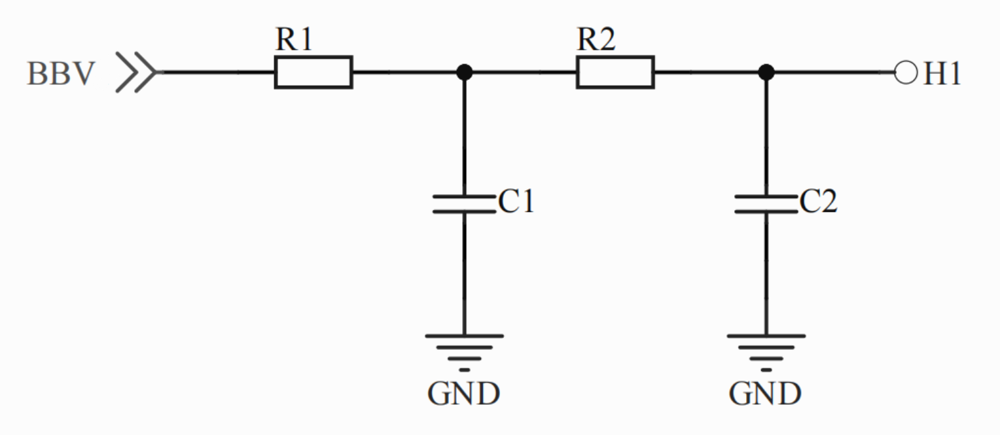

# 高压开关电源纹波对粒子辐射探测器系统噪声影响研究

罗宇琛 于向前† 王玲华 陈鸿飞 施伟红 王永福 王游龙 杨芯 宗秋刚 邹鸿
北京大学 地球与空间科学学院，北京，100871;
†通信作者, E-mail: yuxiangqian@pku.edu.cn

## 摘要

粒子辐射探测器需要在高压电源的偏置下才能正常工作，高压电源的纹波直接影响粒子辐射探测器系统的噪声。本文首先通过理论分析，建立噪声传递函数，得到了从高压电源纹波到粒子辐射探测器系统输出噪声的定量理论模型，并进行了系统仿真验证。仿真结果与理论结果相吻合，验证了理论的适用性。本文的研究可以为后续粒子辐射探测器高压电源的研制提供参考。

**关键词**：粒子辐射探测器；高压电源；电压纹波；噪声分析

## 1 引言

粒子辐射探测器在空间物理、高能粒子物理及医学成像等领域至关重要[1, 2, 3]。粒子辐射探测器依赖高压开关电源，以扩大耗尽区并在耗尽区内形成强电场，驱动电离产生的电荷载流子(电子-空穴对)向电极迁移，生成可测电信号。

高压开关电源纹波通过各种耦合机制影响探测器输出，增加噪声，降低信噪比，并导致数据失真[4]。低纹波的高压开关电源可以确保探测器耗尽区电场的时间一致性，使载流子的漂移稳定；同时减少耦合到输出端的噪声，提高信噪比及能量分辨率[5]。以前人们对高压开关电源纹波对粒子辐射探测器系统噪声的影响的研究定性居多，缺少定量研究[6, 7]。本文将以 Si-PIN 型粒子辐射探测器电路结构为基础，建立从高压开关电源纹波到探测器系统输出噪声的定量理论模型，并通过系统仿真验证其适用性，为提升粒子辐射探测器的测量精度提供理论参考。

## 2 理论分析

### 2.1 电路分析

对于 Si-PIN 型粒子辐射探测器系统，与高压开关电源纹波相关的电路可以大致分为电源滤波电路、电荷敏感前置放大器和整形放大电路三个部分，如图1所示。

图2所示为电源滤波电路的等效电路，可以看作由两个RC 低通滤波器级联而成的二阶滤波架构，用于抑制高频噪声[8]。高压开关电源由BBV输入，经过该滤波网络后，通过H1端子为探测器提供偏置电压。

图3所示为探测器与电荷敏感前置放大器的结构，探测器可以等效为一个二极管和结电容 $C_{\mathrm{d}}$ 并联。在完全耗尽的情况下，结电容 $C_{\mathrm{d}}$ 可由下式计算[9]:

$$
C_{\mathrm{d}} = \frac{\varepsilon_0 \varepsilon_{\mathrm{r}} S}{D_{\mathrm{d}}}
$$

<!-- 其中 $A_{\mathrm{s}}$ 为探测器的等效正对面积(通常在 mm² 量级)，$D_{\mathrm{d}}$ 为探测器厚度(通常在 um 量级)。由此可计算得 $C_{\mathrm{d}}$ 通常在 pF 量级。 -->

其中 $A_{\mathrm{s}}$ 为探测器的等效正对面积(通常在 mm² 量级)，$D_{\mathrm{d}}$ 为探测器厚度(通常在 um 量级)。为确保分析具有实际工程意义，本文选取的探测器及电路参数均基于实验室现有的基于 RENA-3 读出芯片的探测器板卡。在该配置下，探测器结电容 $C_{\mathrm{d}}$ 通常在 pF 量级。

偏置电压 $V_{\mathrm{bias}}$ 的大小与探测器的厚度有关。耗尽层厚度 d 与偏置电压的关系为 $d = \sqrt{2\varepsilon_0\varepsilon_{\mathrm{r}}\mu V_{\mathrm{bias}} / \rho}$ ，为了使探测器完全耗尽，偏置电压至少应该满足

$$
D_{\mathrm{d}} = \sqrt{\frac{2\varepsilon_0\varepsilon_{\mathrm{r}}\mu V_{\mathrm{bias}}}{\rho}}
$$

即

$$
V_{\mathrm{bias}} = \frac{D_{\mathrm{d}}^2\rho}{2\varepsilon_0\varepsilon_{\mathrm{r}}\mu}
$$

其中 $\rho$ 为电阻率，$\mu$ 为多数载流子迁移率。取 $\varepsilon = \varepsilon_0 = 8.85 \times 10^{-12} \text{ F/m}$， $\rho = 10 \text{k}\Omega \cdot \text{cm}$，$\mu = 1200 \text{ cm}^2/(\text{V} \cdot \text{s})$，可计算得对于厚度为 $D_{\mathrm{d}} = 200 \text{ μm}$ 的探测器，需要 $V_{\mathrm{bias}} \approx 200 \text{ V}$。

$C_{\mathrm{x}}$为隔直电容，其容值通常在nF到uF量级，用于阻隔来自探测器的直流电流。探测器产生的电荷信号经$C_{\mathrm{x}}$耦合至电荷敏感放大器(CSA)，经由CSA被放大至适合后续数字信号处理的电平。

整形放大电路与数模转换器一起内置在ASIC中，将放大后的信号整形为类高斯波形，为后续的模数转换做准备。基于实验室现有的基于 RENA-3 读出芯片的探测器板卡，本文假定该电路采用CR-RC滤波器的架构，具有成形时间τ，同时提供增益$A_0$。

> 实际系统互连线存在寄生电容、电感和电阻。依据噪声模型分析[13]，在 60 kHz–300 kHz 纹波频率范围内，寄生电感与电阻的阻抗影响微弱；同时，由于探测器结电容 $C_{\mathrm{d}}$（pF 量级）占主导地位，互连线寄生电容对传递函数的影响亦可忽略。因此，本文在推导中忽略了互连线的寄生参数。

### 2.2 纹波模型

如图4所示，高压开关电源的纹波通常表现为周期性的锯齿波，主要由开关器件的 PWM 控制所引起。其波形的上升沿和下降沿的斜率取决于开关频率、占空比、前级电压以及控制模式，并直接决定了纹波幅度及其频谱分布[11]。

为便于分析，将纹波波形等效为频率、功率相同的正弦波。实际观测到的纹波波形近似为锯齿波，其电压随时间线性变化。对于峰峰值为 $V_{\mathrm{ripple}}$、周期为 $T$ 的锯齿波，其电压可表示为 $v(t) = \frac{V_{\mathrm{ripple}}}{T}t - \frac{V_{\mathrm{ripple}}}{2}$（其中 $t \in [0, T]$）。该波形的归一化平均功率（即均方电压 $V_{\mathrm{rms}}^2$）为
\[
P_{\mathrm{ripple}} = V_{\mathrm{rms,ripple}}^2 = \frac{1}{T}\int_0^T v(t)^2 dt = \frac{1}{T}\int_0^T \left(\frac{V_{\mathrm{ripple}}}{T}t - \frac{V_{\mathrm{ripple}}}{2}\right)^2 dt = \frac{V_{\mathrm{ripple}}^2}{12}
\]对于峰峰值为 $V_{\mathrm{pp,sin}}$ 的正弦波，其振幅为 $V_{\mathrm{pp,sin}}/2$，其归一化平均功率为
\[
P_{\mathrm{sin}} = V_{\mathrm{rms,sin}}^2 = \left(\frac{V_{\mathrm{pp,sin}}/2}{\sqrt{2}}\right)^2 = \frac{V_{\mathrm{pp,sin}}^2}{8}
\]令二者的平均功率相等，即 $P_{\mathrm{ripple}} = P_{\mathrm{sin}}$，得
\[
\frac{V_{\mathrm{ripple}}^2}{12} = \frac{V_{\mathrm{pp,sin}}^2}{8}
\]解出等效正弦波的峰峰值 $V_{\mathrm{pp,sin}}$为
\[
V_{\mathrm{pp,sin}} = \sqrt{\frac{8}{12}}V_{\mathrm{ripple}} = \sqrt{\frac{2}{3}}V_{\mathrm{ripple}}
\]因此，在后续分析中，将峰峰值为 $V_{\mathrm{ripple}}$ 的纹波等效为峰峰值为 $\sqrt{\frac{2}{3}}V_{\mathrm{ripple}}$ 的正弦波。

该等效的合理性基于线性时不变(LTI)系统假设。由于探测器系统呈现低通特性，锯齿波的高次谐波分量被显著衰减。将锯齿波的总功率集中于基频进行正弦等效，相当于将原本会被滤除的高频能量计入输出；相较于仅保留基波分量的近似（$V_{\mathrm{pp,fund}}=\frac{2}{\pi}V_{\mathrm{ripple}}$），本模型采用更高的等功率系数（$\sqrt{2/3} \approx 0.816 > 2/\pi \approx 0.637$），从而提供了对输出噪声的保守估计。[13]

### 2.3 纹波耦合

为定量计算高压开关电源纹波对探测器系统输出噪声的影响，需基于线性电路理论，分析其通过后续电路中频率响应[13]。具体方法为：首先建立纹波传播路径的传递函数模型，再将其与纹波电压频谱相乘，即可得到输出端信号的特征。

电源电压从电源滤波电路的输入端接入，可将其等效为一个叠加于直流高压上的小幅值正弦交流电压源，并设其幅值为 $v_{\mathrm{ripple}}$，频率为 $f_{\mathrm{ripple}}$。
电源滤波电路可建模为两个 RC 滤波器级的级联。电源滤波电路的传递函数为

$$
H_\text{powerFilter}(f) = \frac{1}{1 + j2\pi f R_1 C_1} \cdot \frac{1}{1 + j2\pi f R_2 C_2}
$$

接下来分析偏置电压纹波耦合至 CSA 输出端的频率响应。在 $V_{\mathrm{bias}}$ 处叠加频率为 $f$ 的小幅值交流电压源 $u$，考虑到运算放大器的理想特性，其反相输入端为虚地，故认为该点电势为0。可求得探测器阳极电压$u_1$为

$$
u_1 = u \cdot \frac{j2\pi f C_{\mathrm{d}} R_{\mathrm{b}}}{1 + j2\pi f C_{\mathrm{d}} R_{\mathrm{b}} + j2\pi f C_{\mathrm{d}} R_{\mathrm{b}}} \quad (1)
$$

CSA 的输出电压 $u_2$ 与探测器阴极电压 $u_{\mathrm{d}}$ 的增益由反馈网络阻抗 $Z_{\mathrm{f}}$ 与输入支路阻抗 $Z_{\mathrm{s}}$ 的阻抗比决定，即

$$
\frac{u_2}{u_1} = -\frac{Z_{\mathrm{f}}}{Z_{\mathrm{s}}} = - \frac{1 / (j2\pi f C_{\mathrm{f}})}{R_{\mathrm{s}} + 1/(j2\pi f C_{\mathrm{f}})} \quad (2)
$$

联立式(1)(2)，可得输出电压 $u_2$ 的表达式为

$$
u_2 = - \frac{j2\pi f C_{\mathrm{d}} R_{\mathrm{b}}}{(1 + j2\pi f C_{\mathrm{d}} R_{\mathrm{b}} + j2\pi f C_{\mathrm{d}} R_{\mathrm{b}})(j2\pi f C_{\mathrm{f}}(R_{\mathrm{s}} + 1/j2\pi f C_{\mathrm{f}}))}
$$

从而，从探测器偏置端到 CSA 输出端的纹波耦合传递函数为

$$
H_\text{csa}(f) = \frac{u_2}{u} = - \frac{j2\pi f C_{\mathrm{d}} R_{\mathrm{b}}}{(1 + j2\pi f C_{\mathrm{d}} R_{\mathrm{b}} + j2\pi f C_{\mathrm{d}} R_{\mathrm{b}})(j2\pi f C_{\mathrm{f}}(R_{\mathrm{s}} + 1/j2\pi f C_{\mathrm{f}}))}
$$

接下来计算整形放大电路的响应。假设整形电路的波形成形时间为$\tau$，增益为$A_0$，可计算其传递函数为

$$
H_\text{shaper}(f) = A_0 \frac{j2\pi f \tau}{(1 + j2\pi f \tau)^2}
$$

综合考虑各级电路的频率响应，最终输出的纹波幅值为

$$
v_{\mathrm{ripple,out}} = v_{\mathrm{ripple,in}} |H_\text{powerFilter}(f)|^2 |H_\text{csa}(f)|^2 |H_\text{shaper}(f)|^2 \quad (3)
$$

为量化该噪声对探测器能量分辨率的影响，需将其转换为以电子伏特 (eV) 为单位的半峰全宽 (FWHM)[14]。首先计算噪声等效电荷 (ENC)。考虑到一阶 CR-RC 整形电路输出信号的峰值存在 $1/e$ 衰减，且增益为 $A_0$，得 ENC 与输出纹波电压幅值 $v_{\mathrm{ripple,out}}$ 的关系为
\[
\mathrm{ENC} = v_{\mathrm{ripple,out}} \cdot \frac{e}{A_0} \cdot C_{\mathrm{f}}
\]

其中 $e$ 为自然常数，$C_{\mathrm{f}}$ 为反馈电容。进一步，根据硅材料中产生一个电子-空穴对所需的平均能量 $w = 3.62 \text{ eV}$，以及高斯分布中 FWHM 与标准差 $\sigma$ 的关系 ($\mathrm{FWHM} \approx 2.355 \sigma$)，可得
$$
\mathrm{FWHM} = 2.355 \cdot w \cdot \frac{\mathrm{ENC}}{q} \approx 8.5 \cdot \frac{e \cdot v_{\mathrm{ripple,out}} \cdot C_{\mathrm{f}}}{A_0 q}
$$

其中 $q$ 为元电荷量。

## 3 仿真

为验证前述理论模型的准确性，本文搭建了基于Spice和Python的探测器仿真系统，实现了模拟粒子射入到ADC计数的过程，通过测量纹波对计数结果的影响，定量评估高压开关电源纹波对探测器输出噪声的影响。

### 3.1 仿真算法

本文基于 PySpice 框架搭建了如图5所示的探测器系统Spice仿真电路，包含了电源滤波电路、PIN光电二极管等效电路、电荷敏感放大器及整形放大电路。小幅值正弦交流电压源V1模拟高压开关电源纹波，脉冲电流源Id模拟粒子射入产生的电流。

根据探测器收到的粒子能量，仿真将Id设置为幅值$0.4\mathrm{\mu A}$、脉冲宽度$1\mathrm{\mu s}$、周期$0.987\mathrm{ms}$（频率约为$1013\mathrm{Hz}$）的脉冲电流，用以模拟$9.05\mathrm{MeV}$的粒子以每秒约1000个的通量射入探测器。系统对该电流脉冲的响应为在输出端Vout产生一个类高斯形的电压脉冲（如图6所示），脉冲高度与粒子能量成正比。

为模拟真实探测器的信号处理过程，本文对瞬态仿真输出波形进行分析，设置阈值（1.0V）来识别并测量每个输出脉冲的峰高，并将收集到的所有脉冲峰高数据构建成能谱。电源纹波会导致输出脉冲的基线波动，从而使能谱的峰位展宽。本文以能谱峰的FWHM作为关键指标，定量评估不同参数的纹波对探测器能量分辨率的影响。为更准确地反映真实探测器性能，本文在仿真中引入了额外的高斯噪声，以模拟电子学噪声等系统固有噪声源。此外，由于电源纹波并非高斯白噪声，导致的能谱展宽具有非高斯特性，直接计算FWHM存在困难，叠加高斯噪声可使展宽峰形近似于高斯分布，便于计算FWHM。关于纹波非高斯性的详细讨论见3.3节。图7为纹波幅值$3.0\mathrm{V}$，纹波频率$10\mathrm{kHz}$，固有噪声$5.00\mathrm{keV}$的能谱结果，测得总噪声FWHM为$6.91\mathrm{keV}$，即纹波引入的噪声为$\sqrt{6.91^2-5.00^2}\mathrm{keV}\approx4.77\mathrm{keV}$。

<!-- 仿真使用的电路元件参数见表1。 -->

仿真使用的电路元件参数见表1。这些参数主要参考了基于 RENA-3 专用集成电路（ASIC）的电荷灵敏前置放大器及整形电路的典型配置。

| 变量名 | 值 | 解释 |
| :--- | :--- | :--- |
| $t$ | $2.8 \mathrm{\mu s}$ | 整形放大电路的时间常数 |
| $R_1$ | $13 \mathrm{k\Omega}$ | 电源滤波电路电阻 |
| $C_1$ | $0.1 \mathrm{\mu F}$ | 电源滤波电路电容 |
| $R_2$ | $10 \mathrm{M\Omega}$ | 电源滤波电路电阻 |
| $C_2$ | $0.01 \mathrm{\mu F}$ | 电源滤波电路电容 |
| $C_{\mathrm{d}}$ | $2\text{pF}$ | 探测器结电容 |
| $C_{\mathrm{x}}$ | $0.1\mathrm{\mu F}$ | 隔直电容 |
| $C_{\mathrm{f}}$ | $3 \mathrm{pF}$ | 反馈电容 |
| $R_{\mathrm{b}}$ | $100 \mathrm{M\Omega}$ | 偏置电阻 |
| $R_{\mathrm{f}}$ | $200 \mathrm{M\Omega}$ | 反馈电阻 |
| $A_0$ | $38 \times e$ | 整形放大电路的增益 |

### 3.2 仿真结果

本文分别对纹波幅值$0.1\mathrm{V}$至$10.0\mathrm{V}$，纹波频率$100\mathrm{Hz}$至$500\mathrm{kHz}$的纹波对探测器输出Vout的影响进行了仿真，每个数据点仿真3秒（约3000个峰值），并将仿真结果与理论计算结果进行比较，如图8所示。虽然仿真结果在低频段（$<10\mathrm{kHz}$）显著小于理论结果，但在高频段（$>10\mathrm{kHz}$）与理论结果基本吻合，最高误差不超过5%。对于高压开关电源纹波的典型频率（60～300kHz）[15]，本文得出的模型对于高压开关电源纹波的适用性良好。在70kHz的典型开关频率下，峰峰值为2V（即幅值为1V）的纹波在探测器系统输出端引入约1 keV FWHM的噪声，显著降低系统能量分辨率。

### 3.3 纹波非高斯性影响分析

在噪声分析中，通常将噪声源视为高斯白噪声[13]，其耦合到探测器输出端形成高斯形的能峰，可由FWHM衡量。但高压开关电源纹波通常包含确定的周期性分量(锯齿波或方波)，并非高斯白噪声，其耦合到探测器输出端通常成为基频谐波，无法直接用FWHM衡量。

设纹波耦合到探测器输出端的功率为$v_\text{ripple}^2$，假设成为正弦波，则幅值分布为\[P_\text{sine}(x)=\frac{1}{\pi\sqrt{2v_\text{ripple}^2-x^2}}\]

假设为高斯白噪声，则幅值分布为\[P_\text{gaussian}(x)=G(0, v_\text{ripple}^2)\]

设输出端固有噪声功率为$v_\text{other}^2$，两种假设下幅值分布分别为\[P_\text{total,sine}(x)=P_\text{sine}(x)*G(0, v_\text{other}^2)\]和\[P_\text{total,gaussian}(x)=P_\text{gaussian}(x)*G(0, v_\text{other}^2)=G(0, v_\text{other}^2+v_\text{ripple}^2)\]

图9、图10展示了在两种假设下，在探测器输出端存在不同功率固有噪声时，纹波耦合到探测器输出端的幅值分布以及总FWHM差异。当固有噪声的功率超过纹波噪声两倍时，两种假设下的FWHM差异在5%以内，可以认为纹波非高斯性引入的误差是可接受的；当固有噪声的功率低于纹波噪声两倍时，两种假设下的FWHM差异最高可达约31%，需要考虑纹波非高斯性引入的误差。

## 4 实验验证

在仿真分析的基础上，本文进一步搭建实验平台，采用信号发生器产生可控纹波并注入探测器读出电路，实测纹波对输出噪声的影响，以验证理论模型的适用性。

本实验所采用的探测器电路结构与第 2 节所述基本相同。为隔离纹波噪声贡献，避免探测器本征噪声（如漏电流噪声、g-r 噪声等）的干扰，本实验以 2pF 电容（等效于一个面积为 $20\mathrm{mm}^2$、厚度为 $100\mathrm{\mu m}$ 的探测器）替代探测器元件。实验中由信号发生器产生频率为 $70\mathrm{kHz}$、峰峰值为 $5\mathrm{V}$ 的锯齿波，并耦合至偏置通道以模拟高压电源纹波；同时在电容两端注入 1kHz 方波脉冲以模拟粒子射入响应。具体结构如图 12 所示。电路元件参数详见表 1。

实验线路连接示意如图 13 所示。信号发生器一方面向等效探测器注入 1kHz 方波脉冲用于事件模拟，另一方面在 BBV 处注入 $70\mathrm{kHz}$、$5\mathrm{V}$ 锯齿波用于模拟纹波。探测器系统的输出信号通过串口传输至 PC，在 PC 端进行数据采集与统计分析，进而获得噪声的 FWHM。

在本实验中，信号发生器产生一系列不同幅度的 1kHz 方波信号，以模拟每秒 1000 个粒子射入探测器。通过调节方波幅度，实现不同强度信号输入，从而模拟探测器对不同能量粒子事件的响应，并测量相应的 FWHM。

不注入纹波、接入纹波通道（0V 基线）和接入锯齿纹波三种工况的实验结果分别如表 2、表 3、表 4 所示。对比表 3 和表 4 可见，注入锯齿纹波后输出噪声FWHM增加约\(\sqrt{5.61^2-4.55^2}\mathrm{keV}\approx3.28\mathrm{keV}\)，与理论结果\(2.5\mathrm{keV}\)在量级上一致，验证了本文所建立纹波耦合模型的可用性。

实验实测值略高于理论值，其误差主要来源于两方面：一是实验采用分立元件搭建，较长的连接线引入了额外的寄生电容与电感回路；二是信号发生器在输出大振幅波形时叠加了额外的宽带背景噪声。

表2 不注入纹波的结果

| 信号强度 / keV | Peak / 道数 | FWHM / 道数 | FWHM / keV |
| :--- | :--- | :--- | :--- |
| 509.0625 | 9380 | 11 | 4.4726 |
| 610.875 | 9126 | 11 | 4.4726 |
| 712.6875 | 8874 | 10 | 4.066 |
| 814.5 | 8624 | 11 | 4.4726 |
| 916.3125 | 8379 | 11 | 4.4726 |
| **平均 FWHM / keV** | | | **4.39128** |

表3 接入纹波通道（0V 基线）的结果

| 信号强度 / keV | Peak / 道数 | FWHM / 道数 | FWHM / keV |
| :--- | :--- | :--- | :--- |
| 509.0625 | 9408 | 11 | 4.4726 |
| 610.875 | 9146 | 11 | 4.4726 |
| 712.6875 | 8887 | 11 | 4.4726 |
| 814.5 | 8632 | 12 | 4.8792 |
| 916.3125 | 8379 | 11 | 4.4726 |
| **平均 FWHM / keV** | | | **4.55392** |

表4 接入 $70\mathrm{kHz}$、$5\mathrm{V_{pp}}$ 锯齿纹波的结果

| 信号强度 / keV | Peak / 道数 | FWHM / 道数 | FWHM / keV |
| :--- | :--- | :--- | :--- |
| 509.0625 | 9422 | 14 | 5.6924 |
| 610.875 | 9150 | 14 | 5.6924 |
| 712.6875 | 8899 | 13 | 5.2858 |
| 814.5 | 8670 | 15 | 6.099 |
| 916.3125 | 8419 | 13 | 5.2858 |
| **平均 FWHM / keV** | | | **5.61108** |

## 5 总结

本文对高压电源纹波在 Si-PIN 型粒子辐射探测器中引入的输出噪声进行了定量的分析，建立了一个从纹波时域波形预测探测器系统输出噪声 FWHM 的数值模型，并通过实验验证了模型的准确性。

<!-- 本文得出的结论为，高压电源纹波是探测器系统输出噪声的重要来源。在本文的参考电路中，峰峰值约 800mV 的纹波耦合到输出端，会产生 keV 量级的噪声。 -->

> 本文得出的结论为，高压电源纹波是探测器系统输出噪声的重要来源。在本文的参考电路中，峰峰值约 5V 的纹波耦合到输出端，会产生 keV 量级的噪声。需要指出的是，虽然本研究基于 Si-PIN 探测器和 RENA-3 读出芯片的特定参数，但所建立的纹波耦合理论模型对其他半导体探测器系统（如 CdTe、CZT 等）同样具有理论指导意义[1, 9]。对于此类采用电荷敏感前置放大器（CSA）架构的系统，其噪声耦合机制在物理本质上是通用的，仅需根据探测器结电容及电路参数进行重新标定即可应用本模型。然而，对于液体闪烁体探测器等基于光电倍增管（PMT）或硅光电倍增管（SiPM）的系统，由于其信号读出与增益机制的差异，本模型的定量结论不应直接套用。

本研究填补了高压电源纹波对粒子辐射探测器噪声影响定量分析的空白。本文所提出的理论模型与实验方法可为高性能粒子探测系统的低噪声电源设计提供重要的理论依据和设计参考。

## 参考文献
[1] Capan, Ivana. 2024. 《Wide bandgap semiconductors for radiation detection: A review》. Materials 17(5):1147. doi:10.3390/ma17051147.
[2] Hoeferkamp, M. R., S. Seidel, S. Kim, J. Metcalfe, A. Sumant, H. Kagan, W. Trischuk, M. Boscardin, G. F. Dalla Betta, D. M. S. Sultan, N. T. Fourches, C. Renard, A. Barbier, T. Mahajan, A. Minns, V. Tokranov, M. Yakimov, S. Oktyabrsky, C. Gingu, P. Murat和M. T. Hedges. 2022. 《Novel Sensors for Particle Tracking: a Contribution to the Snowmass Community Planning Exercise of 2021》.
[3] Michail， Christos， et al. "Radiation Detectors and Sensors in Medical Imaging." Sensors (Basel， Switzerland) 24.19 (2024): 6251.
[4] Naeem, Naveed. 2021. 《Characterizing the PSRR of Data Acquisition μModule Devices with Internal Bypass Capacitors》.
[5] Moktan H， Panta RK， Cho SH. Bias-voltage dependent operational characteristics of a fully spectroscopic pixelated cadmium telluride detector system within an experimental benchtop x-ray fluorescence imaging setup. Biomed Phys Eng Express. 2021 Dec 7;8(1):10.1088/2057-1976/ac3d9c. doi: 10.1088/2057-1976/ac3d9c. PMID: 34874017; PMCID: PMC8675630.
[6] Lasko, P., M. Adamczyk, J. Brzychczyk, P. Hirnyk, J. Łukasik, P. Pawłowski, K. Pelczar, A. Snoch, A. Sochocka, Z. Sosin, J. Barney, G. Cerizza, J. Estee, T. Isobe, G. Jhang, M. Kaneko, M. Kurata-Nishimura, W. G. Lynch, T. Murakami, C. Santamaria, M. B. Tsang和Y. Zhang. 2017. 《KATANA - a charge-sensitive triggering system for the S$π$RIT experiment》. Nuclear Instruments and Methods in Physics Research Section A: Accelerators, Spectrometers, Detectors and Associated Equipment 856:92～98. doi:10.1016/j.nima.2017.03.006.
[7] Silva, L. Raveen S. De. 2023. 《Critical analysis on efficiency and noise reduction methodologies of a switch mode power supply using LISN topology》.
[8] Fu， Hongze et al. “Research on the Passive and Active Low Pass Filters.” Highlights in Science， Engineering and Technology (2023): n. pag.
[9] Radeka, V. 1988. 《Low-Noise Techniques in Detectors》. Annual Review of Nuclear and Particle Science 38(Volume 38, 1988):217～77. doi:10.1146/annurev.ns.38.120188.001245.
[11] SCHNIER S, FAGNANI A, NACHBAUR O. Low-Noise and Low-Ripple Techniques for a Supply Without an LDO [R]. Dallas: Texas Instruments, 2024. SLUP409.
[13] Bertuccio, Giuseppe, 和Filippo Mele. 2023. 《Electronic Noise in Semiconductor-Based Radiation Detection Systems: A Comprehensive Analysis With a Unified Approach》. IEEE Transactions on Nuclear Science 70(10):2310～21. doi:10.1109/TNS.2023.3310357.
[14] Zhai， Qingtai . Development of a novel delta E-E particle identification telescope readout system. Diss. Boston University. 2007.
[15] Wang, Y.; Lucia, O.; Zhang, Z.; Gao, S.; Guan, Y.; Xu, D. A Review of High Frequency Power Converters and Related Technologies. IEEE Open Journal of the Industrial Electronics Society 2020, 1, 247–260. https://doi.org/10.1109/OJIES.2020.3023691.

