# 概述

## Si-PIN探测器

### 基本原理

- PN结
- 高压偏置扩大耗尽区
- 粒子射入产生电子-空穴对
- 电子空穴对被收集形成电荷信号
- 电荷信号与能量的关系

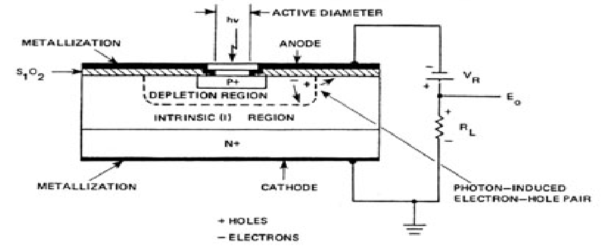

### 电路结构

- 探测器
    - 等效为二极管与电容并联
    - 需要串联一个偏置电阻放电
    - 粒子射入->电荷聚集到电容，产生阶跃信号
- 隔直电容
- 电荷敏感前置放大器
    - 有放大作用
    - 本质是对电流的积分（电荷量）
- 高斯滤波成形电路
    - 放大，并将阶跃信号整形为类高斯形脉冲
    - 脉冲的高度代表了粒子能量

### 噪声的本质

- 来源：暗电流噪声、本底噪声、散粒噪声、热噪声、读出噪声
- 耦合：最终耦合到探测器输出端
- 对探测结果的影响：认为噪声的高斯随机的，使计数结果“模糊”。
    - 举例：delta函数与高斯函数卷积
    - 量化：FWHM

随机变量的相加，其概率密度函数为两个随机变量的概率密度函数的卷积。
\[
P(X_1+X_2) = P(X_1) * P(X_2)
\]

以delta函数为例，它与高斯函数的卷积为高斯函数。
\[
\delta(x-x_0) * G(x) = G(x-x_0)
\]

高斯随机噪声的存在使能谱难以分辨。
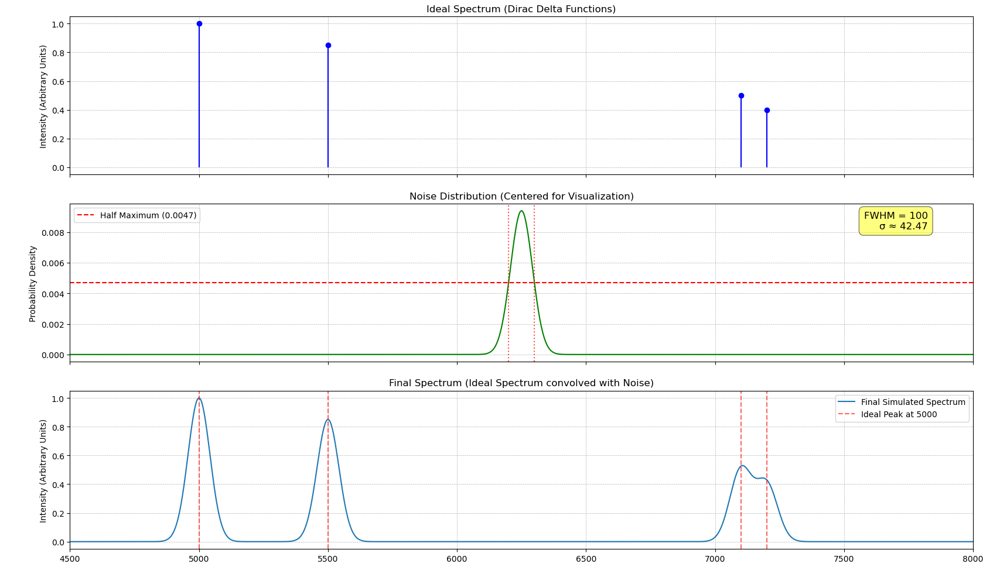

用FWHM来量化噪声。

### 在空间任务中的应用

- BepiColombo计划
    - BERM探测器（BepiColombo Environment Radiation） 2018-2024
    - 硅堆叠

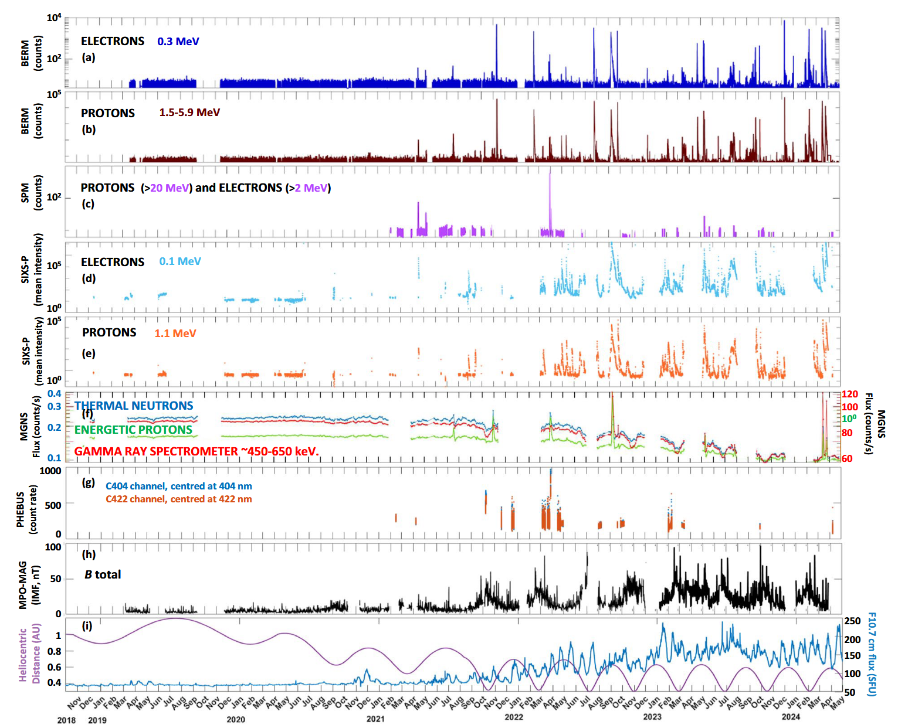

## 高压开关电源纹波

- 以boost为例
- 电源不断给电感充磁放磁

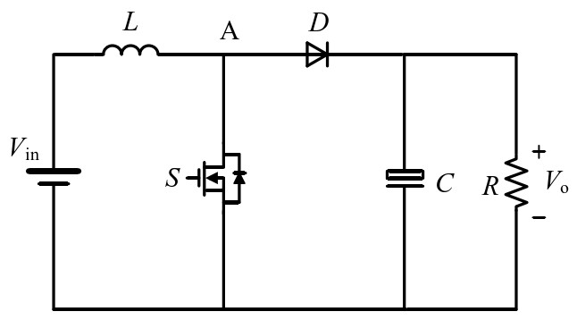

- 输出电流形成锯齿形纹波

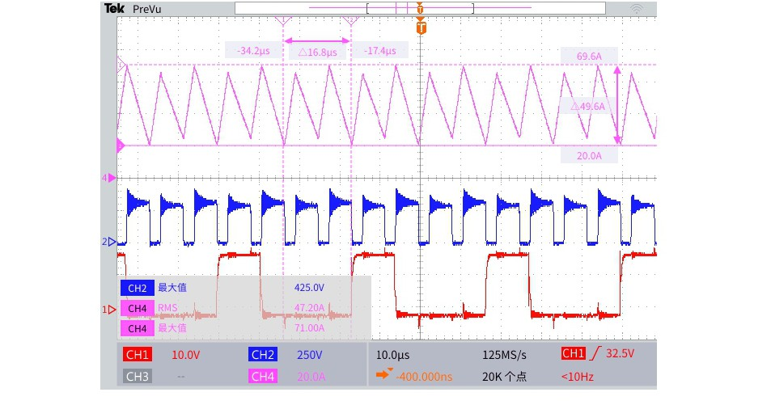

## 纹波耦合路径

### 电路框图

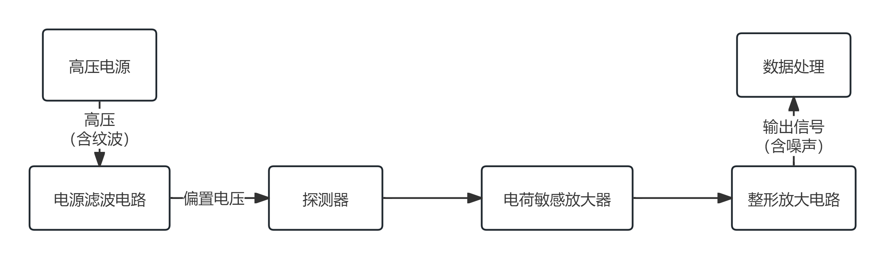

### 电源滤波电路

- 看作两个RC滤波器串联
- 滤去高频干扰

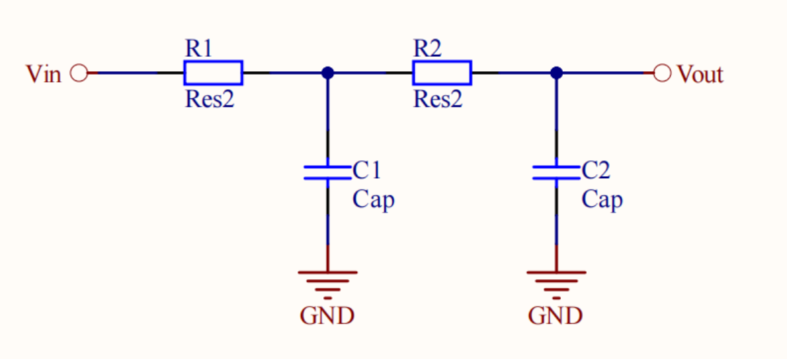

### 探测器

- 等效为二极管与电容并联
- 需要串联一个偏置电阻放电
- 由于隔直电容远大于探测器电容，需要考虑隔直电容的影响

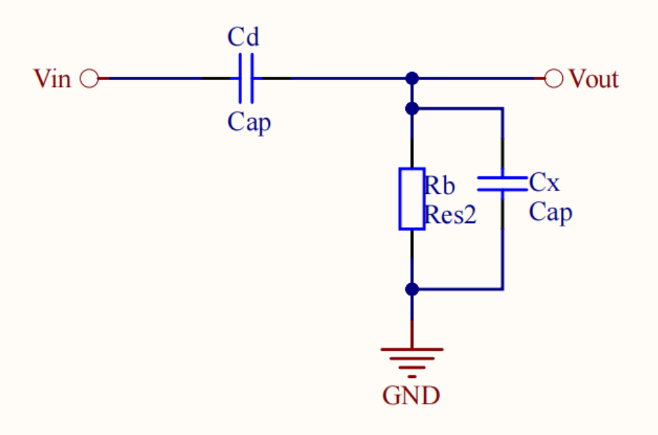

### 电荷敏感放大器

- 与探测器之间接一隔直电容，阻挡直流
- 增益为反馈回路与输入回路阻抗比值，近似为反馈电容与隔直电容的比值

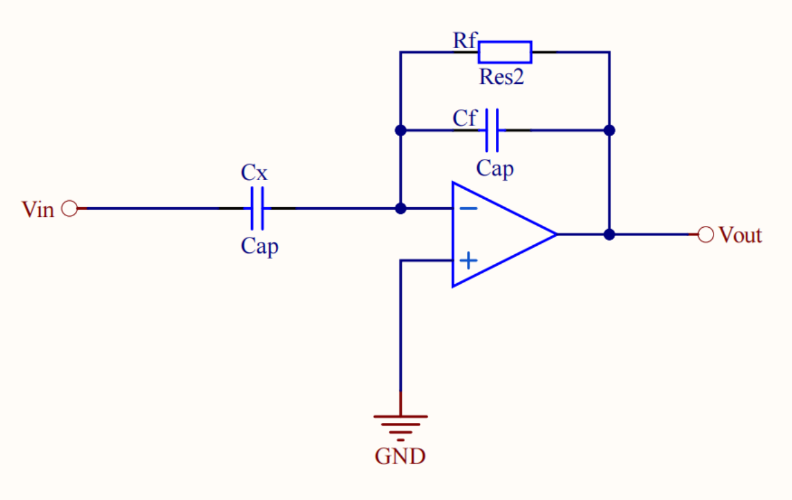

\[A=\frac{1/(1/R_\text{f}+sC_\text{f})}{1/sC_\text{x}}\approx\frac{C_\text{x}}{C_\text{f}}\]

### 整形放大电路

- 一阶CR-RC滤波器
- 阶跃信号->类高斯脉冲
- 峰值与阶跃信号强度成正比，存在衰减

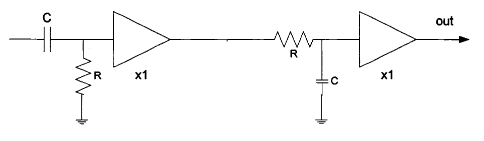

\[f(t)=A_0\frac{t}{\tau}e^{-\frac{t}{\tau}}\]

\[f_{\text{max}}=\frac{A_0}{e}\]

## 频率响应分析

### 零极点

- 电源滤波电路
    - 二阶低通滤波
    - 实轴上的两个极点
    \[H_{\text{powerFilter}}(s)=\frac{1}{(1+sR_1C_1)(1+sR_2C_2)}\]

- 探测器
    - 相当于一个高通滤波器
    - 原点处有零点，负半轴一个极点
    \[H_{\text{detector}}(s)=\frac{1/(1/R_{\text{b}}+sC_{\text{f}})}{1/sC_{\text{f}}+1/(1/R_{\text{b}}+sC_{\text{x}})}\]

- 电荷敏感放大器
    - 放大+低通滤波
    - 原点处有零点，负半轴一个极点
    \[H_{\text{CSA}}(s)=\frac{1/(1/R_\text{f}+sC_\text{f})}{1/sC_\text{x}}\]

- 整形放大电路
    - 一阶CR-RC滤波器
    - 原点处有零点，负半轴一个极点
    \[H_{\text{shaper}}(s)=\frac{A_0(s\tau)}{(1+s\tau)^2}\]

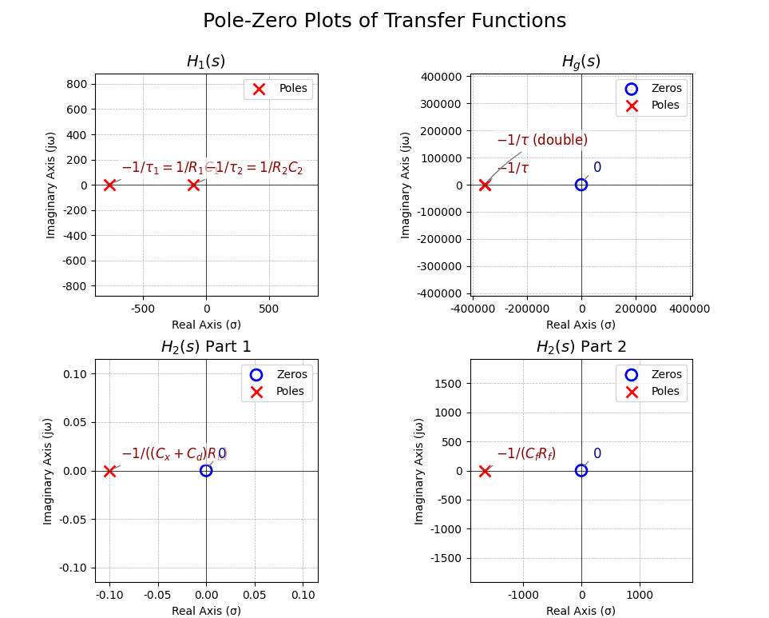----------------------------------------

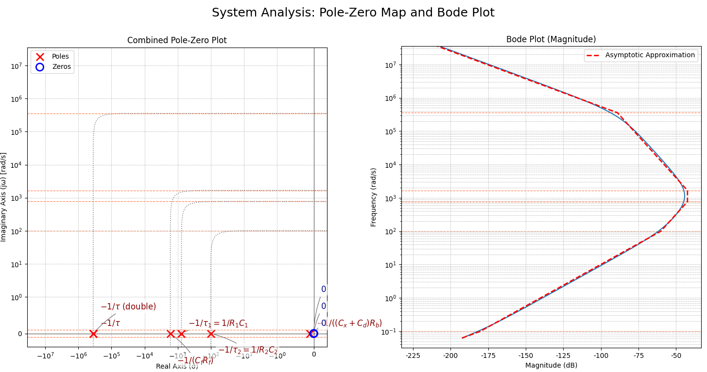

- 总传递函数

\[H_{\text{total}}(s)=H_{\text{powerFilter}}(s)\cdot H_{\text{detector}}(s)\cdot H_{\text{CSA}}(s)\cdot H_{\text{shaper}}(s)\]

## 仿真计算

### 纹波等效为正弦波

- 对于幅值为$V_{\text{ripple}}$的正弦波，其频率为$f_{\text{ripple}}$
- 理论输出噪声功率为
\[v^2_{\text{total}}=v^2_{\text{ripple}}\cdot |H_{\text{total}}(s)|^2 / 2\]

### 考虑纹波的各个频率成分

- 有时纹波会伴随工频干扰和宽频噪声
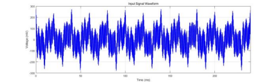
- 这时各个频段的噪声贡献都需要考虑
- 假设纹波有功率谱密度$\text{PSD}_{\text{ripple}}(f)$
- 理论输出噪声功率为
\[v^2_{\text{total}}=\int_0^{\infty} \text{PSD}_{\text{ripple}}(f)\cdot |H_{\text{total}}(s)|^2\cdot \text df\]

### 换算为FWHM

- 假设都是高斯随机的噪声
\[FWHM=2.355\cdot\frac{\text{ENC}}{q}\cdot3.62\text{eV}\approx8.5\cdot\frac{e}{A_0}\cdot v_{\text{total}}C_\text{f}\]

### 仿真结果

- 对于0.4V，2100Hz的纹波，理论计算FWHM约为1.86keV
- 对于实际测得的纹波频谱
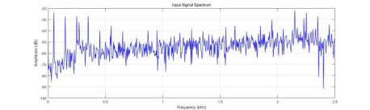
计算得到FWHM约为[PLACEHOLDER]keV

### 纹波非高斯性的影响

- 正弦假设下，纹波耦合输出噪声为正弦波
- 噪声分布为
\[P(x)=\frac{1}{\pi\sqrt{v_{\text{total}}^2-x^2}}\]
- 与单峰高斯分布有显著差别
- 与其他噪声叠加后，正弦假设下的FWHM略大
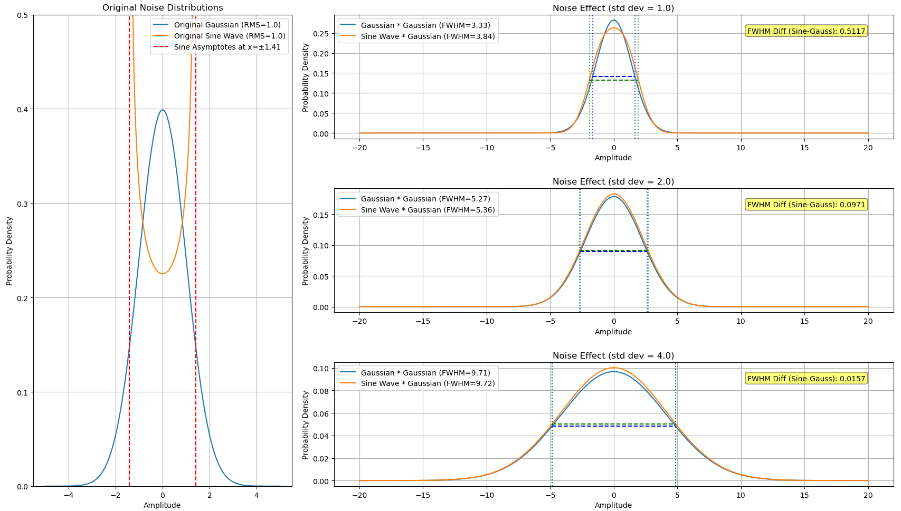
- 其他噪声越强，该效应越弱
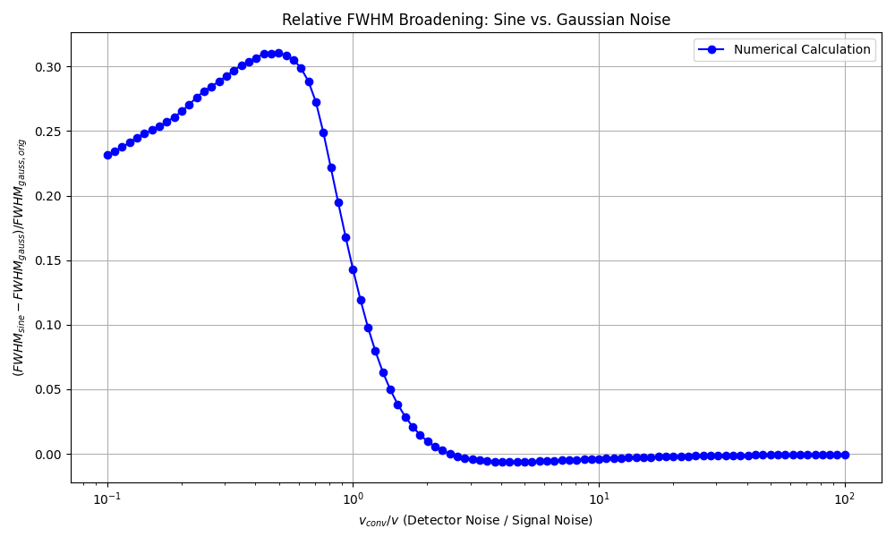

## 实验结果

- 实验使用的高压电源纹波

- 实验参数与仿真参数一致

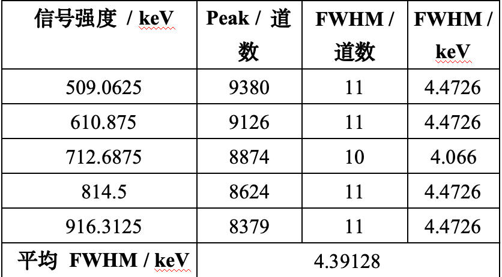
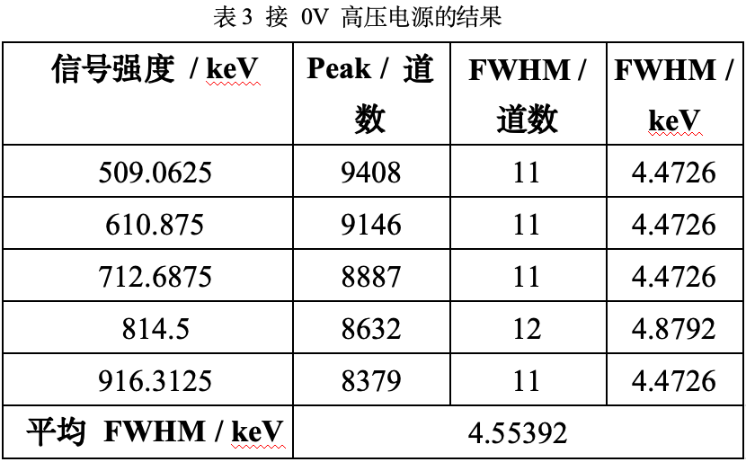
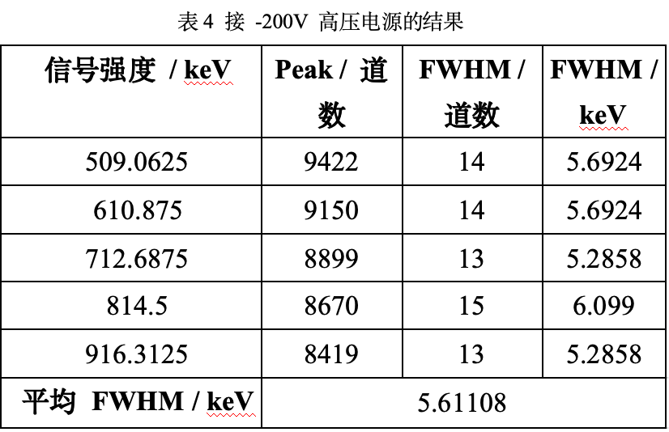
